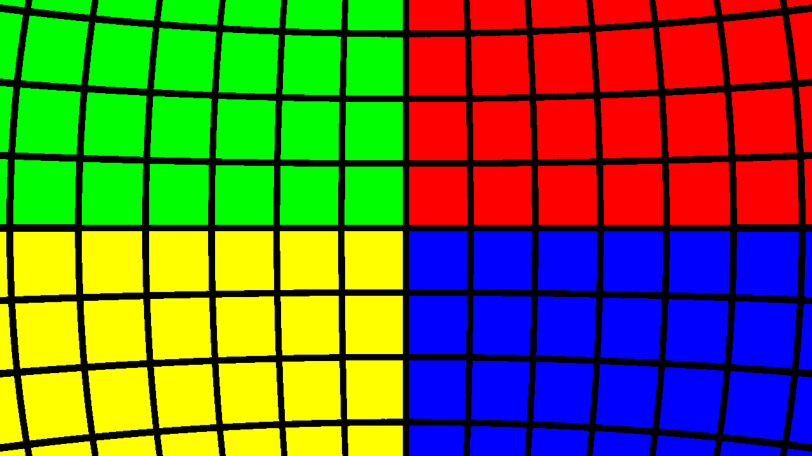
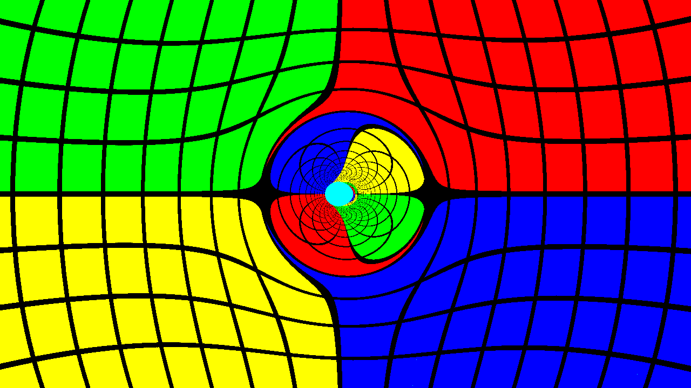

# TetraGray

> **⚠️ Development Status**: This Lean 4 port is still a work in progress and not fully functional yet. The core geometric algebra implementation is in place, but the raytracing component is under active development.

A port of [Tetra Gray](https://github.com/muphrid15/tetra-gray) to Lean 4. This project implements a general-relativistic raytracer in Lean 4, leveraging Lean's strong type system and functional programming features.

Original description by Michael Clark (muphrid15):

---

Introducing **Tetra Gray**, a general-relativistic raytracer. Tetra Gray has performed raytracing in spinning black hole spacetimes using a single coordinate system, both inside and outside the black hole horizon.

Raytracing in general relativity sheds light on several interesting optical effects: curved spacetime bends light, requiring step-by-step integration of trajectories to compute the paths of light rays.

It does something like this. Here's a flat space image with a false-color sphere:



And here's that same system with a spinning black hole in front of the camera:



## How does Tetra Gray work?

Tetra Gray uses several semi-independent components to build up the raytracing simulation and image. Broadly, the pipeline is broken down into distinct stages:

- Image initial data: computing the directions of each photon corresponding to a single pixel, based on the field of view, camera position and orientation, and image dimensions.
- Casting photons into the scene: the photons are evolved backward in time using numerical integration. The particular spacetime being used dictates the time derivatives of the photon's position and momentum.
- Stopping evolution: numerical integration is terminated when the photon meets some termination condition. This could be a distance threshold from the central black hole or some analysis of the photon's redshift to determine that it is trapped within the black hole.
- Converting photons to pixel colors: photon position and/or momentum dictates the color of the pixel it's associated with. This could be based on a real background image (a survey of the galaxy) or some artificial "painted" surface surrounding the system.
- Writing the image to disk: The Lean 4 port outputs PPM images which can be converted to other formats.

TetraGray is designed to be modular: using higher-order functions, different termination conditions, integrators, spacetimes, or colormaps can be used without affecting the general structure of the computation.

## Building and Running the Lean 4 Port

### Requirements
- Lean 4 (version 4.0.0 or higher)
- Lake build system

### Setup
Clone the repository and build the project:

```sh
git clone https://github.com/yourusername/TetraGray
cd TetraGray
lake build
```

### Running
The simplest way to run TetraGray is using the included Justfile:

```sh
# Render the flat space scene
just run-flat

# Render the spinning black hole (Doran) scene
just run-doran

# Render to a specific output directory
just run-to-dir output_dir

# Convert a PPM image to PNG (requires ImageMagick)
just convert-image doran.ppm
```

Or run manually:

```sh
lake exe TetraGray flat   # Generate flat space rendering
lake exe TetraGray doran  # Generate black hole rendering
```

### Output Files
By default, output images are saved to the current working directory:
- `flat.ppm` - The flat space scene
- `doran.ppm` - The spinning black hole scene

These PPM files can be converted to PNG using ImageMagick or similar tools.

## Lean 4 Implementation Details

The Lean 4 port takes advantage of Lean's powerful functional programming features:

- Geometric algebra implemented using Lean's type system
- Pure functional implementation of integration algorithms
- Type-safe multivector operations
- Monadic handling of ray tracing computations

The port focuses on clarity and correctness, leveraging Lean's strong typing to prevent common errors in geometric calculations.

## Description of Primary Components

The following is a general description of each general stage of the raytracing simulation.

### Image Initial Data

Implemented in `TetraGray/Image.lean`, the image initial data module generates photon positions and directions based on camera parameters, image dimensions, and field of view.

From the central view direction of the camera, photons' momenta are rotated along the vertical and horizontal directions of the camera. Hence, each pixel's photon is rotated by a fixed angle from its horizontal and vertical neighbors.

## Photon Evolution

Unlike raytracing in Newtonian physics, general relativistic raytracing requires numerical integration. Photons can follow curved paths that cannot be computed in advance.

`TetraGray/Integrator.lean` implements a generic ODE integrator with a 4th order Runge-Kutta stepper that can be customized for different applications.

A photon is characterized by position (that is, four coordinates--time, and x, y, z Cartesian coordinates for instance) and momentum. And more or less as in Newtonian mechanics, the derivative of position is momentum, and the derivative of momentum is acceleration. Both can be influenced, however, by the effects of spacetime.

In the spinning black hole spacetime, we use an adaptive stepsize algorithm to supplement the integrator. This adjusts the steps in evolution parameter by looking at the maximum distance (or coordinate time) the photon could travel in a step and normalizing this across all photons. This ensures that all photons are evolved by an appropriate step.

## Termination Conditions

The evolution of a single photon can be stopped by any arbitrary condition provided. Typical ones are included in `TetraGray/Integrator.lean`. Various reasons to stop the evolution include escape beyond a fixed radius, a total amount of the evolution parameter (corresponding, naively, to some maximum number of steps), or--in the case of adaptive steps--a maximum ratio between the baseline step and the current step. The latter is particularly useful for detecting when photons fall irretrievably beyond a black hole horizon.

## Photon Array to Image

Each photon is converted into an RGB color. `TetraGray/Image.lean` implements the colormapping functionality. This paints a sphere with four regions of color and latitude/longitude gridlines, making for easy visualization of the stretching of spacetime in all regions.

The image is then written to disk in PPM format.

## Utilities and Mathematical Models

The Lean 4 port includes:

- `TetraGray/Clifford.lean`: Implementation of Clifford algebra (geometric algebra) in Lean 4
- `TetraGray/Raytracer.lean`: Core raytracing implementation
- `TetraGray/Scenes/`: Scene definitions for different spacetimes

## Clifford Algebra-based Tensor Manipulations

Clifford algebra provides a powerful tool for performing general relativity calculations without needing the full gamut of tensor algebra. The power of Clifford allows us to describe the orientation of the camera with the `Versor` type, a spacetime analogue of a quaternion. This is far more compact than using a full 4D rotation/boost matrix, as well as far easier to normalize, and orthogonality of the resulting camera directions is better preserved.

`